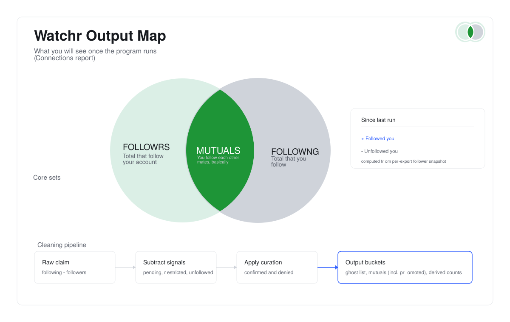

# Watchr

### Your unofficial watcher for Instagram exports.

Parse an **Instagram data export** (JSON from *Accounts Centre → Download your information*)
and print readable, offline reports: connections, activity, login history, and ad tracking.
Watchr tells you who followed or unfollowed since your last run, who doesn't
follow you back, and who you don't follow back — no online account required,
no tracking, no third-party cloud.

> **Who's watching you back?** Know who *actually* cares.

Standard library only · Python **3.10+** · personal details **redacted by default**

## Quick start

```bash
# 1. Clone (you init git when ready)
git clone <repo-url> && cd watchr

# 2. Optional: install console entry point
pip install -e ".[dev]"

# 3. Try the bundled demo export (no personal data required)
python3 instagram_analysis.py --check \
  --export-dir tests/fixtures/minimal_export/instagram-demo-2026-01-01-TEST01

python3 instagram_analysis.py \
  --export-dir tests/fixtures/minimal_export/instagram-demo-2026-01-01-TEST01 \
  --section connections

# 4. Use your own export (after requesting JSON from Instagram — see docs/export-checklist.md)
python3 instagram_analysis.py --check --export-dir ~/Downloads/instagram-yourname-2026-01-01-AbCdEf
python3 instagram_analysis.py --export-dir ~/Downloads/instagram-yourname-2026-01-01-AbCdEf

# Or pass the ZIP directly (no manual unzip)
python3 instagram_analysis.py --zip ~/Downloads/instagram-yourname-2026-01-01-AbCdEf.zip
```

Copy `.env.example` to `.env` and set `INSTAGRAM_EXPORT_DIR` if you prefer not to pass `--export-dir` every time.

## What it reports

Watchr's core job is **watching your follows** — who followed, who unfollowed,
who doesn't follow you back, and who you don't follow back:

| Section | Insights |
|---|---|
| **Connections** | Who followed / who unfollowed since last run, raw export totals vs app insights, cleaned don't-follow-back list (pending/restricted/curated buckets), mutuals, app-derived reconciliation counts, blocked, close friends |
| **Activity** | Posts/stories by month, likes, comments, search history |
| **Security** | Login history, active sessions |
| **Ads & Tracking** | Ad interests, advertisers with your data, off-Instagram activity |
| **Profile** | Username, bio, privacy flags from the export |

> Results reflect the ZIP snapshot only. See [docs/counts-explained.md](docs/counts-explained.md) when numbers differ from the app.

### Visual output map



Minimal map of the Connections report: core follower/following sets, run-to-run
delta output, and the cleaning pipeline from raw claim to final buckets.

## CLI

```bash
python3 instagram_analysis.py [options]

  --export-dir DIR    Unzipped export folder
  --zip FILE          Export ZIP (extracted for this run)
  --check             Verify setup; exit 0 if ready to analyze
  --section NAME      profile | connections | activity | security | ads | all
  --curated FILE      curated_followers.txt override — handles you visually
                      confirmed follow you back (promoted into Mutuals)
  --curate            Interactive curation session: asks for your in-app
                      follower/following totals, then walks you through
                      unverified accounts (y/n/s/a/q) until the curated
                      numbers resemble the app; answers persist
  --bootstrap-curated Write a commented checklist of unverified handles to
                      curated_followers.txt for in-app verification, then exit
  --assume-mutual     Treat the unverified remainder as mutuals (moved into
                      Mutuals, labeled as assumed) — only if you know you
                      follow everyone back
  --output FILE       Write report to FILE instead of stdout
  --no-redact         Show raw email, phone, DOB, IPs
```

After `pip install -e .`, the same commands work as `watchr`.

Export resolution order: `--export-dir` / `--zip` → `$INSTAGRAM_EXPORT_DIR` → auto-detect `instagram-*` next to the project.

## Curation — closing the incomplete follower list

Your export's follower file is almost always a **partial snapshot**, so the raw
"following − followers" list over-counts who *doesn't* follow you back. Curation
is Instagram's missing signal: you tell the analyzer which of those unverified
handles actually follow you (or don't), and it promotes/denies them so the
curated numbers match what the app shows.

**For cloners:** curation state is **per-export and never committed**. The live
files (`curated_followers.txt`, `curated_nonfollowers.txt`, `curation_meta.json`)
sits next to your export (or in a stable `~/.cache/watchr/<export>/` cache
for extracted ZIPs) and is gitignored, so a fresh clone starts with an empty,
clean slate — curate your own data without inheriting anyone else's.

### Recommended workflow

```bash
# 1. Generate a verification checklist (optional, but handy for the app).
#    Writes commented-out handles to curated_followers.txt inside your export:
python3 instagram_analysis.py --export-dir ~/Downloads/instagram-yourname-2026-01-01-AbCdEf --bootstrap-curated

# 2. Open each handle in the Instagram app -> Following -> search your username.
#    - they follow you back -> uncomment the line
#    - they don't            -> leave it commented
#    (or just run the interactive session, which asks the same questions.)

# 3. Interactive curation session:
python3 instagram_analysis.py --export-dir ~/Downloads/instagram-yourname-2026-01-01-AbCdEf --curate
```

Inside the session:

- Enter your in-app **Followers** and **Following** totals (the report then
  compares the curated estimate against them — the loop's stopping condition).
- Walk each unverified handle: `y` = follows you back (promoted to Mutuals),
  `n` = doesn't (stays denied, never re-asked), `s` = skip, `a` = assume all
  remaining follow back, `q` = quit.
- Answers **save automatically after every batch**, so you can quit and resume
  later — progress is never lost.

After the session the same command re-prints the report with your fresh
answers applied (look for `+N promoted — confirmed via curation` under Mutuals).

Need to curate non-interactively? `run_curation_batch(graph, store, decisions)`
applies a `{handle: follows_back}` map the same way the wizard does — see
`curate_session.py` and `tests/test_cleaning.py`.

See [docs/adr/0002-curation-store.md](docs/adr/0002-curation-store.md) for
per-export state placement and [docs/adr/0006-curation-state-deferred.md](docs/adr/0006-curation-state-deferred.md) for the state-machine extraction.

## Repository layout

```
.
├── instagram_analysis.py   # Main analyzer (the "watchr" engine)
├── connections/graph.py    # Shared follower/following loader
├── connections/cleaning.py # Data cleaning & curation pipeline
├── curate_session.py       # Interactive curation wizard (--curate)
├── export_paths.py         # Export folder / ZIP resolution
├── setup_check.py          # --check diagnostics
├── sanitize.py             # Redact output for sharing
├── tests/fixtures/         # Demo export (safe to commit)
├── docs/                   # Export checklist & counts explained
├── output.example.txt      # Sample report from fixture (sanitized)
└── instagram-<you>-…/      # Your export — gitignored, contains your
                            #   curated_followers.txt / curation_meta.json
                            #   (personal; never committed)
```

## Getting an export

See **[docs/export-checklist.md](docs/export-checklist.md)** — request **JSON**, include **Followers and following**, **All time**.

## Privacy

- Analyzer masks email, phone, DOB, and login IPs by default.
- `instagram-*/` and `output.txt` are gitignored.
- Sanitize before sharing:

  ```bash
  python3 instagram_analysis.py --export-dir … --output output.txt
  python3 sanitize.py output.txt -o shareable.txt
  ```

## Development

```bash
pip install -e ".[dev]"
pytest
python3 instagram_analysis.py --check --export-dir tests/fixtures/minimal_export/instagram-demo-2026-01-01-TEST01
```

Regenerate committed example output after report changes:

```bash
python3 instagram_analysis.py \
  --export-dir tests/fixtures/minimal_export/instagram-demo-2026-01-01-TEST01 \
  --section all | python3 sanitize.py - \
  --export-dir tests/fixtures/minimal_export/instagram-demo-2026-01-01-TEST01 \
  -o output.example.txt
```

CI runs the same checks on push (see `.github/workflows/ci.yml`).

## Import as a library

> **Brand vs. module name:** The package is branded as `watchr`, but the
> internal Python module is still `instagram_analysis` — this is intentional.
> The module name describes what it *does* (analyse Instagram exports), while
> `watchr` is the user-facing brand. No rename is needed.

```python
from pathlib import Path
from context import AnalyzerContext
from instagram_analysis import run_reports

ctx = AnalyzerContext(
    base_dir=Path("tests/fixtures/minimal_export/instagram-demo-2026-01-01-TEST01"),
    redact=True,
)
run_reports(ctx, {"connections"})
```

## License

MIT — see [LICENSE](LICENSE).
